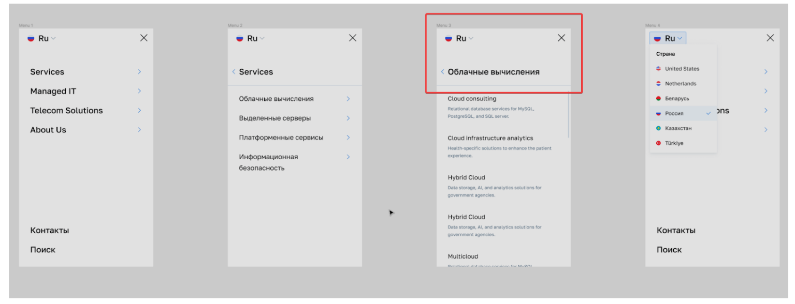

# mobie-burger-menu
Тестовое задание для ITGLOBAL.COM

### Задача
Необходимо сверстать мобильное меню по макету, добавить необходимый JS для взаимодействия с ним, как интерактивным элементом.

### Пояснения
1. Мобильное меню изначально скрыто. Появляется по нажатию кнопки (бургера) – ее нет в макете, поэтому вид не важен. 
2. Меню фиксировано, высота 100%.
3. При нажатии на основной пункт меню происходит «проваливание» в дочернее меню данного пункта.
4. Если пунктов становится много и весь список перестает помещаться в экран, в правой части появляется скролл, при этом “шапка” меню остается фиксированной.
5. Большой крест в верхнем правом углу закрывает меню.
6. Предусмотреть анимацию появления самого меню и выпадающего списка переключения языков, транзишены, ховеры и другие состояния для интерактивных элементов.